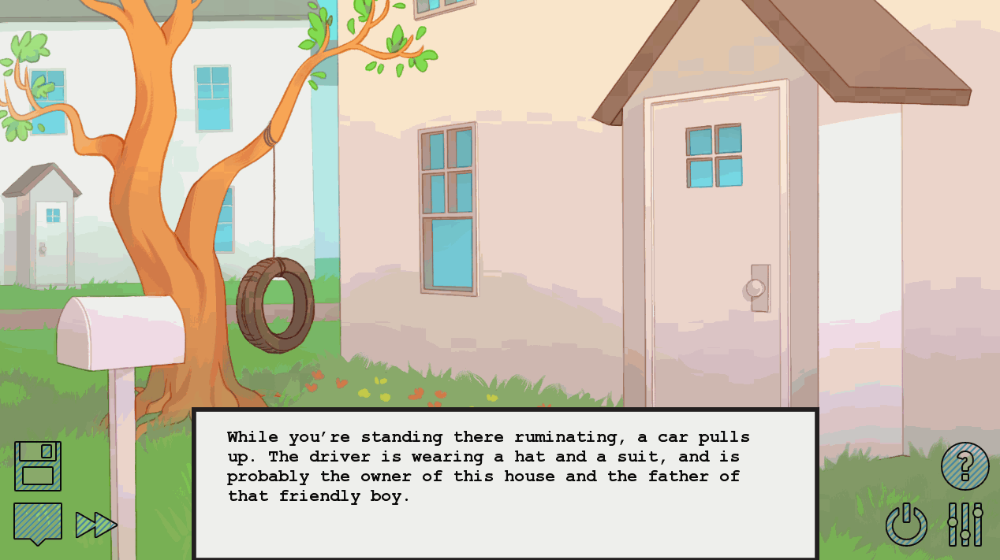
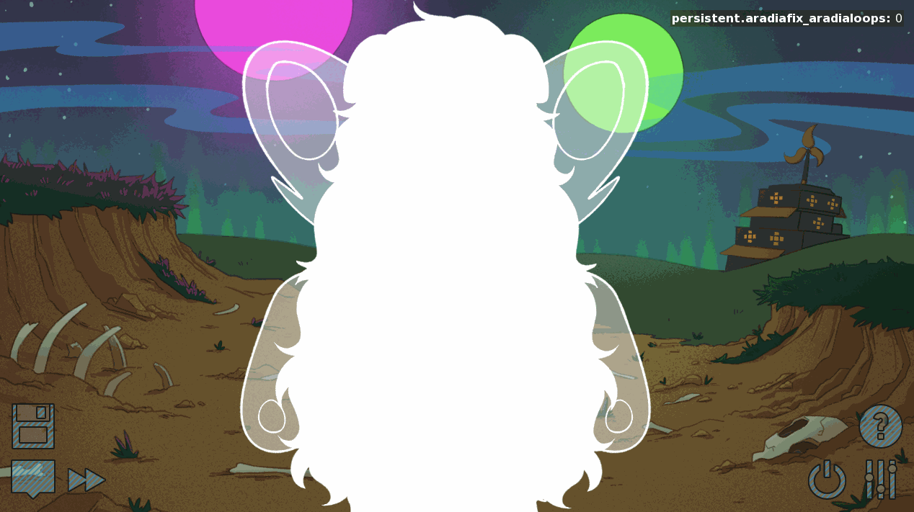

## Mistakes to avoid

This is a list of common mistakes and how to avoid them.

Warning: This document contains spoilers for pesterquest.


### Double dialogue




```python
    "Oh shit. You’re just standing out here with all his mail, he’s going to think you’re trying to rob the place."

    menu:
        "Oh shit. You’re just standing out here with all his mail, he’s going to think you’re trying to rob the place."
```


In this scene, pesterquest prompts you for a choice. But, when the choice window is on the screen, they also want you to be able to see the prompt, so they say the line of dialogue twice. This looks bad. Don't do this.

Here's how to fix it:

```python
    "Oh shit. You’re just standing out here with all his mail, he’s going to think you’re trying to rob the place."

    menu:
        "Oh shit. You’re just standing out here with all his mail, he’s going to think you’re trying to rob the place.{fast}"
```

The `{fast}` dialogue text automatically skips all text *up until* that tag. This allows for a seamless transition.


```python
ara talk "this is not the first"
# User clicks.
ara waggle "this is not the first {cps=4}{i}time{/i}"
# User clicks.
ara talk "this is not the first {i}time{/i} we have met"
```

The Aradia route also has this problem. Every time they she makes a time pun, you have to click through and see the entire bit again. It's not smooth, and it breaks the game feel.

Here's how to fix this.

```python
ara talk "this is not the first{nw}"
ara waggle "this is not the first{fast} {cps=4}{i}time{/i}{nw}"
ara talk "this is not the first {i}time{/i}{fast} we have met"
```

In line 1, aradia says the line "this is not the first", but then the `{nw}` tag breaks to the next dialogue option without prompting for user input.

In line 2, aradia skips past "this is not the first", so the text doesn't have to animate over again. The `{cps}` tag now slows down the word "time" to 4 characters a second, letting the animation linger on the "waggle" animation for a full second. Again, this goes to the next line without confirmation.

In line 3, we skip to after the word "time" and continue dialogue as normal.

Here's how that all looks put together:



