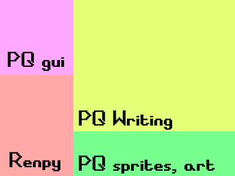
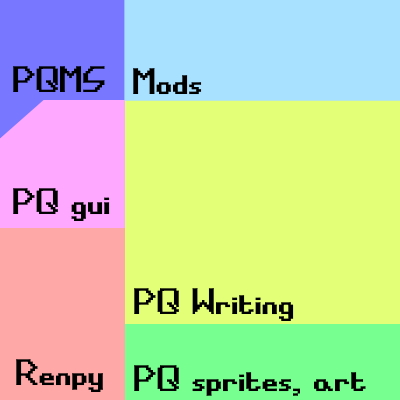
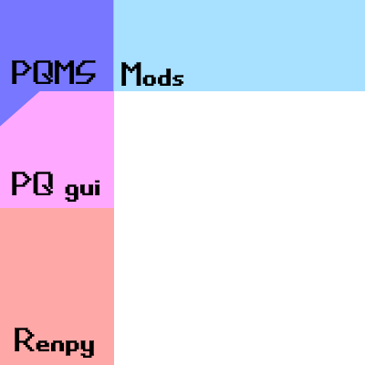
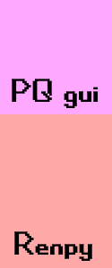
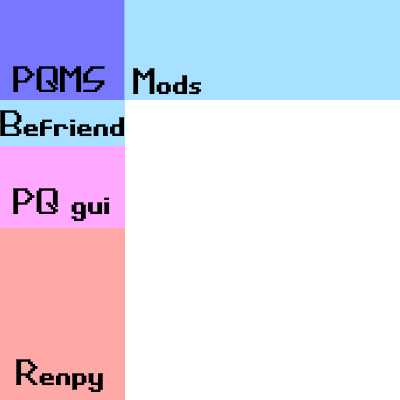

## Pesterquest Lite

or, "Can I distribute my mod as a standalone game?"

The answer is **yes.** By using `dist_standalone.py`, FSE will generate a self-contained game containing your mod that you can safely (and legally!) ship out to anybody for free.

Here's how that works.

This is vanilla pesterquest.

This is pesterquest using FSE: You get pesterquest plus any mods you have loaded.

This is what you get when you distribute your mod as a standalone game. 

I do this by making a dummy renpy game called PQ lite: no content, no writing, just frameworks. You can then run FSE on this instead of pesterquest.

The liteskins system allows you to customize some elements of the GUI if you're packaging your mod standalone. Here's an example of how some of the unique befriendus assets replace elements of the pesterquest GUI using lite distribution:

